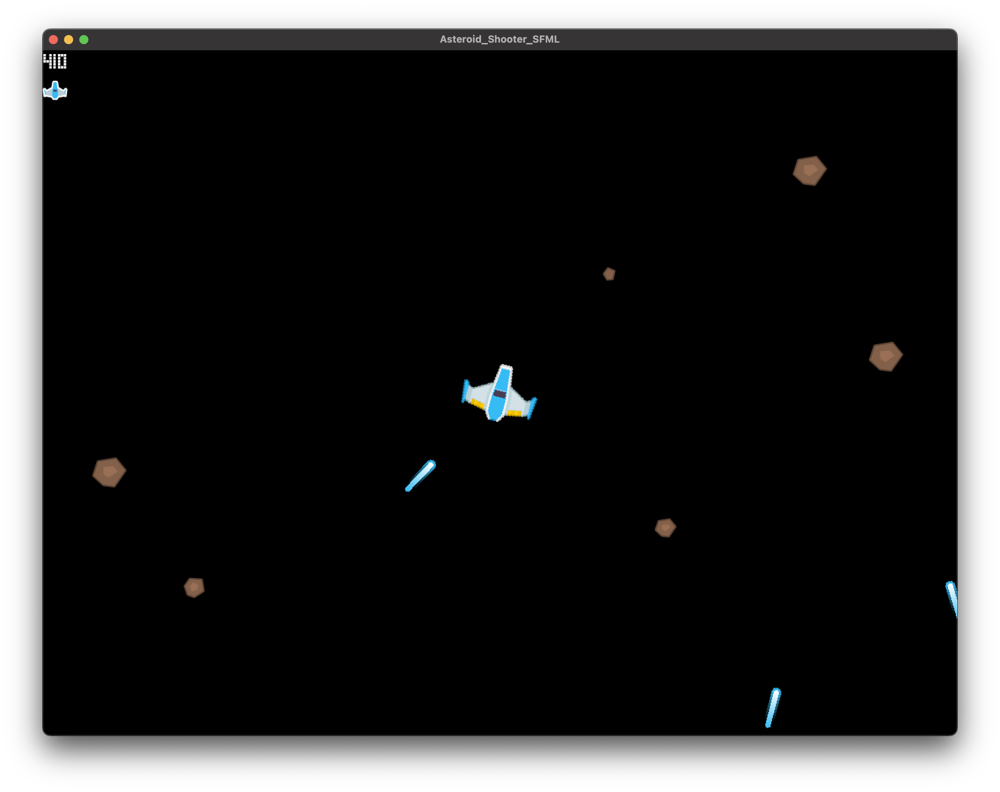

# SFML Asteroid Shooter

## Setup

### Prerequisites

To set up this repository, you will need:

- `cmake` with version `3.23` or higher
- Compiler that supports C++20
- [SFML library 2.6.0](https://github.com/SFML/SFML)

SFML Asteroid Shooter Game adapted from SFML Blueprints

